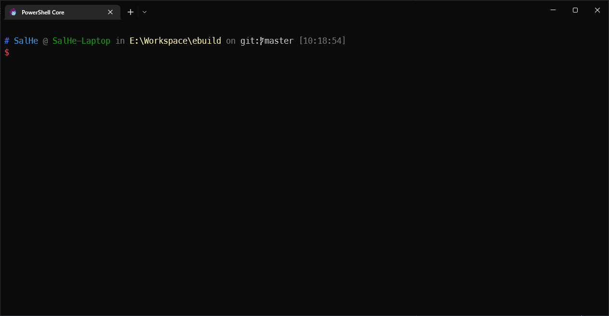
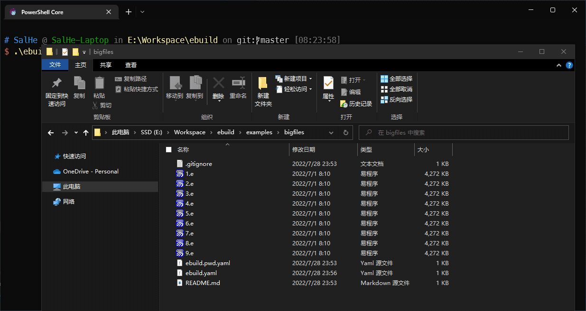

# ebuild

`ebuild`是一个针对易语言的构建工具，该工具主要使用配置化的方式完成自动化的将易语言源文件转换成文本格式描述的文件(使用了[e2txt](http://e2ee.jimstone.com.cn/downloads/))
，以及借助[ecl](https://bbs.125.la/forum.php?mod=viewthread&tid=14553929&highlight=ecl)完成源文件编译。

**该项目目前处于开发阶段。**

## 特性

- [x] 可根据需要选择需要完成自动化管理的易语言源文件
- [x] 可排除特定源文件
- [x] 批量完成e2txt/txt2e
- [x] 文件清理
    - *.recover.e 使用`txt2e`从文本格式代码恢复出来的易语言二进制源文件
    - *.ecode 使用`e2txt`从易语言二进制源文件转换出来的文本格式代码
    - ebuild-out 中构建生成的文件
- [ ] 检测源文件变化，并自动转换成文本格式的代码
- [x] 批量构建目标
  - 全构建
  - 指定构建目标
- [ ] 构建前后动作
- [ ] 使用易语言程序作为自动化构建脚本
- [ ] TO BE CONTINUED...

## 效果图



```shell
# 预览当前项目配置信息

./ebuild.exe info --build ./example/
```



```shell
# 批量将源文件转换到文本格式的代码

./ebuild.exe e2txt --build ./example/
```

## 引用项目

该项目的存在离不开以下作者和项目为易语言生态带来的贡献：

- [e2txt](http://e2ee.jimstone.com.cn/) by [JimStone](http://e2ee.jimstone.com.cn/)
- [易语言命令行编译工具 ecl](https://bbs.125.la/forum.php?mod=viewthread&tid=14553929&highlight=ecl)
  by [被封七号](https://bbs.125.la/home.php?mod=space&uid=504218&do=thread&type=thread&view=me&from=space)

> 如有任何形式的对于作者或项目的侵犯行为，请见谅，并联系我对项目做出调整或者下架。
