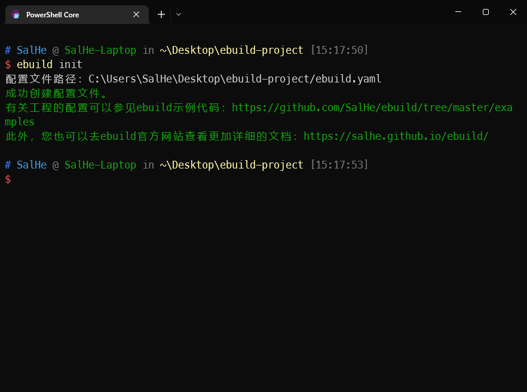
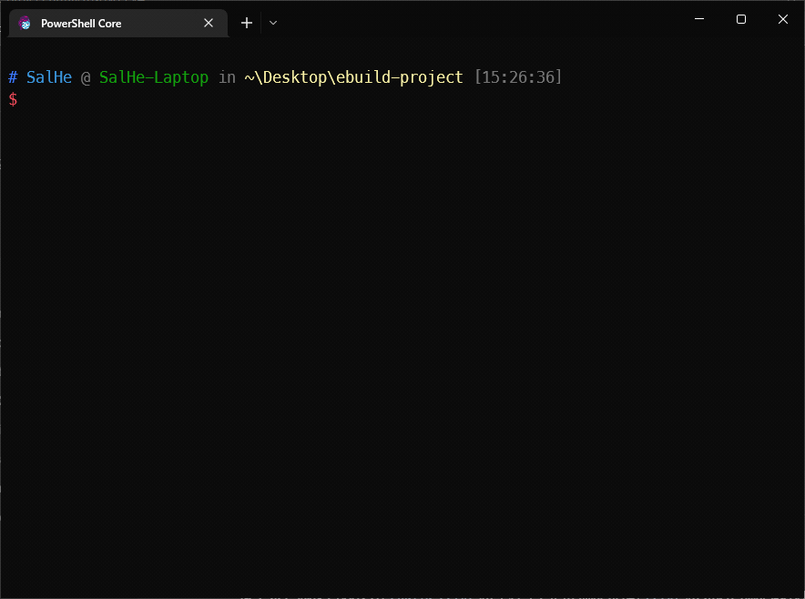
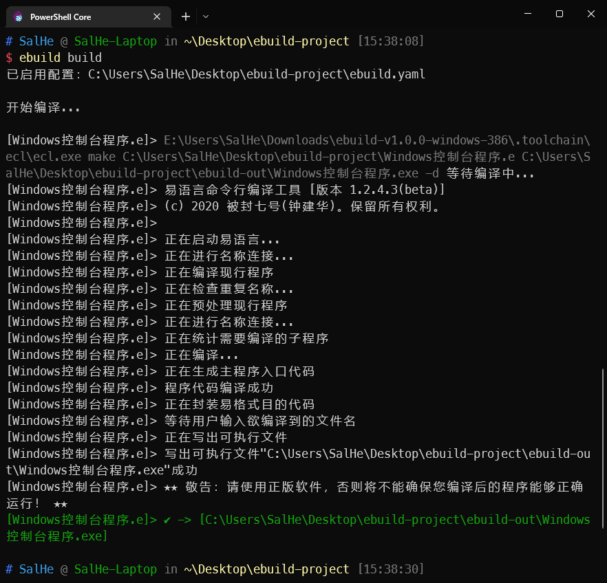
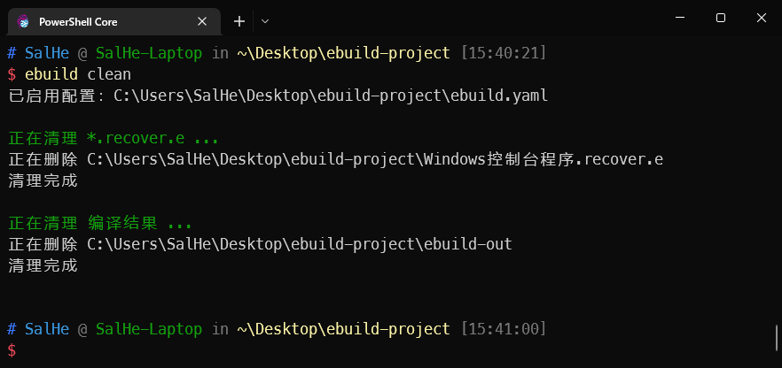

# 第一个工程

在安装好`ebuild`及相关工具之后，您便可以享受由`ebuild`为您带来的好处了。

## 初始化工程

新建一个文件夹如`ebuild工程`，打开命令行并进入到该文件夹中，执行：

```shell
ebuild init
```

执行完成后，您可以看到以下提示，同时`ebuild`将为您创建与工程相关的一些文件。



## 工程文件

```
ebuild-project
 ├── .gitignore         # git将忽略的文件列表
 ├── ebuild.pwd.yaml    # ebuild中源码的密码(如果有密码的话)
 ├── ebuild.yaml        # ebuild工程配置文件，描述了工程自身的信息、包含的源码、源码的编译方式等。
 └── README.md
```

## 添加源码

现在您可以在该目录下创建易语言源码。

比如在工程目录下创建一个`Windows控制台程序.e`：

```
.版本 2

.程序集 程序集1

.子程序 _启动子程序, 整数型, , 本子程序在程序启动后最先执行


标准输出 (, “你好，ebuild！”)

返回 (0)  ' 可以根据您的需要返回任意数值
```

## `e2txt`

接下来，您便可以使用`ebuild e2txt`将工程中包含的源码借助`e2txt`将易语言源码转换成文本格式的代码，这样可以方便您使用`git`来管理您的代码。



完成上述转换后，您可以在`<工程根目录>\Windows控制台程序.ecode`看到您的文本格式的代码。

## `txt2e`

同时也可以使用`ebuild txt2e`将工程中的文本格式的代码恢复为易语言源文件(该恢复过程只针对被包含在工程中的源文件对应的文本格式代码)，此外恢复的源文件的文件名中将加入`.recover`。比如，`<工程根目录>\Windows控制台程序.ecode`恢复后，您将得到恢复后的源文件``<工程根目录>\Windows控制台程序.recover.e`。

::: info
由于`e2txt`和`txt2e`并不是一个完全逆向的过程，`ebuild`不会主动将您原本的源文件替换为恢复的源文件`*.recover.e`，这是出于对您数据的安全性考虑。
:::

## 构建工程

使用`ebuild build`您便可以将工程中的所有源文件根据配置完成编译了。编译后的文件目前会输出到`<工程根目录>\ebuild-out\`中，后续版本可能考虑允许您自定义输出目录。



在上述的输出结果中，我们可以看到编译后的文件输出到`C:\Users\SalHe\Desktop\ebuild-project\ebuild-out\Windows控制台程序.exe`去了。

## 清理工程

使用`ebuild clean`您可以清理`ebuild`生成的中间文件。



## 最后

这里只是简单说明`ebuild`的使用，关于配置文件的详细细节和命令行的相关参数等将在其他文档中进行讨论。

本文中的工程可以参见 https://github.com/SalHe/ebuild/blob/master/examples/first-project 。