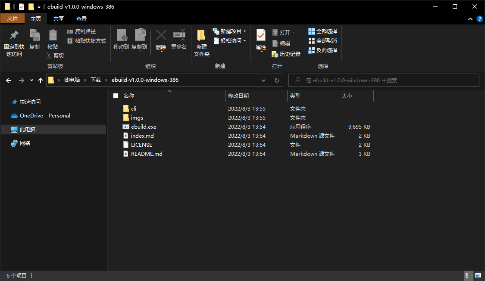
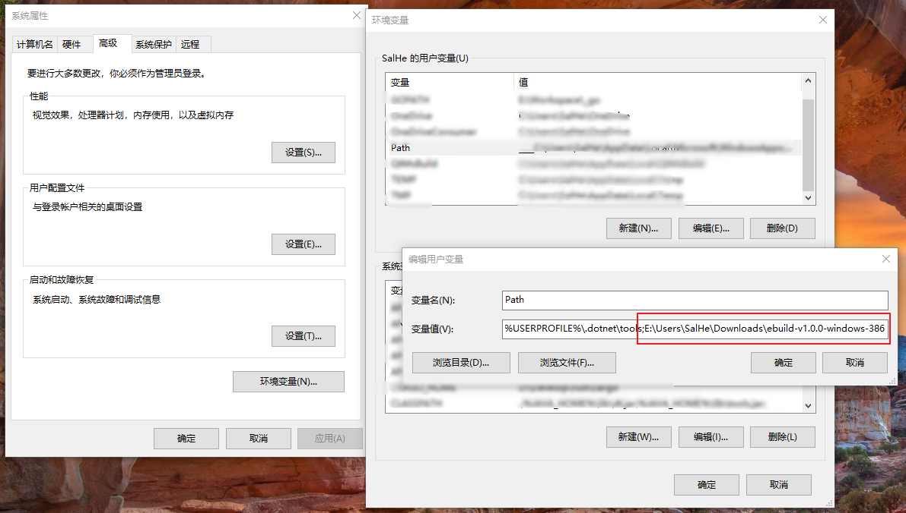
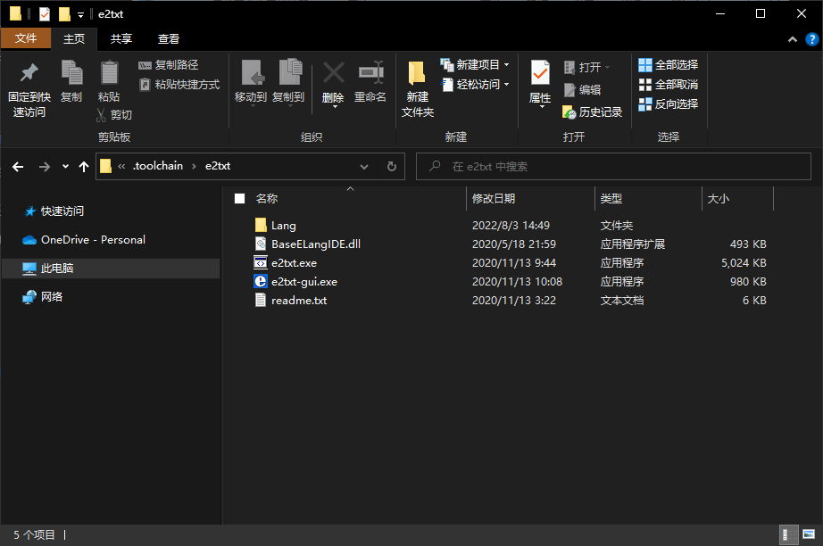
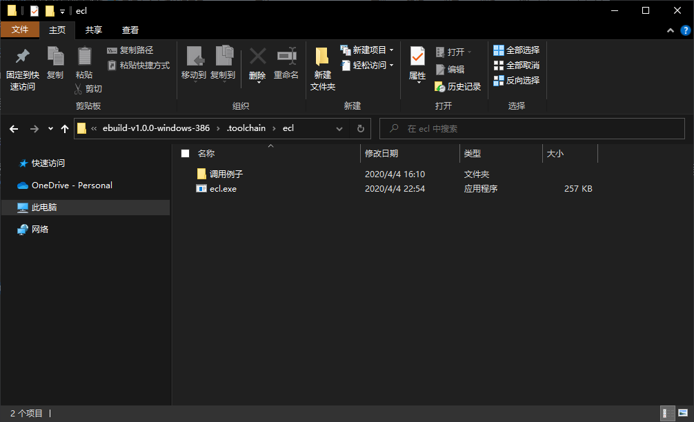
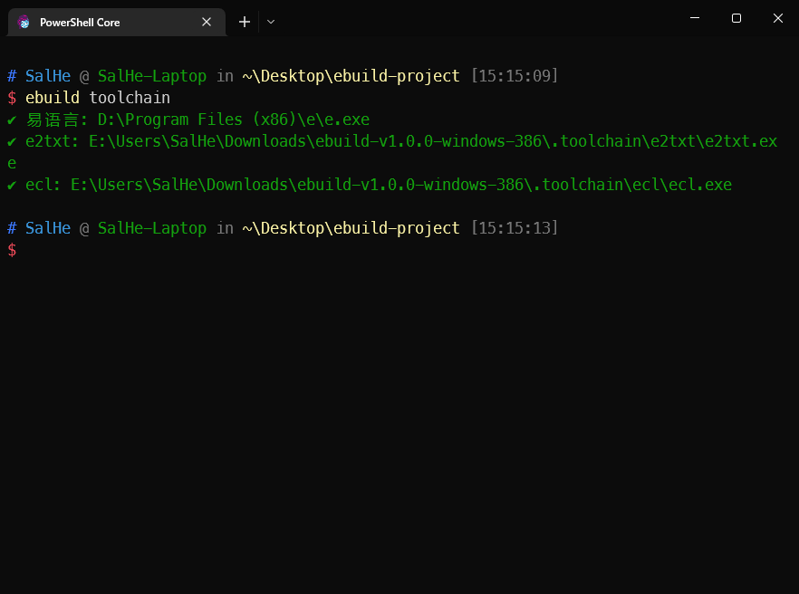

# 安装

在使用`ebuild`之前，您还需要安装以下工具：

- [易语言](http://www.eyuyan.com/)
- [e2txt](http://e2ee.jimstone.com.cn/)
- [易语言命令行编译工具 ecl](https://bbs.125.la/forum.php?mod=viewthread&tid=14553929&highlight=ecl)

## 安装易语言

安装易语言使用易语言官方安装包安装完成即可。

## 安装`ebuild`

### 下载并解压`ebuild`

从[GitHub下载ebuild最新版本](https://github.com/SalHe/ebuild/releases)，并将其解压到一个文件夹中即可。



::: tip

为了您的安全，建议您不要从其他地方下载`ebuild`。同时也非常推荐从源文件编译`ebuild`。

:::

### 配置环境变量

可以将`ebuild`安装目录添加到系统环境变量`Path`中去，这样即可在命令行窗口中直接使用`ebuild`。



您可以将ebuild的安装目录按下图方式追加到`Path`环境变量的末尾去。比如`ebuild`的安装目录为`E:\Users\SalHe\Downloads\ebuild-v1.0.0-windows-386`，则您应在`Path`末尾追加`;E:\Users\SalHe\Downloads\ebuild-v1.0.0-windows-386`(请注意前有分号。)

### 创建 `.toolchain` 文件夹

在`ebuild`的安装目录下创建名为`.toolchain`的文件夹，用于存放`e2txt`和`ecl`。

## 安装`e2txt`

从[E2EE](http://e2ee.jimstone.com.cn/downloads/)找到`e2txt 1.2 - 易语言代码文本互转神器`并下载。

下载后，将`e2txt`解压到`<ebuild安装目录>\.toolchain\e2txt`目录下。




## 安装`ecl`

从[易语言命令行编译工具 ecl v1.2.4.3(beta)(出处: 精易论坛)](https://bbs.125.la/forum.php?mod=viewthread&tid=14553929)下载`ecl`，并安装与[安装`e2txt`](#安装e2txt)类似的方式将`ecl`解压到`<ebuild安装目录>\.toolchain\ecl`目录下。



## 完成安装后的效果

完成安装后，您的目录结构应大致如下：

```
ebuild-v1.0
 ├── .toolchain
 │   ├── e2txt
 │   │   ├── BaseELangIDE.dll
 │   │   ├── e2txt-gui.exe
 │   │   ├── **e2txt.exe**
 │   │   ├── Lang
 │   │   │   └── ELang
 │   │   └── readme.txt
 │   └── ecl
 │       ├── ecl.exe
 │       └── 调用例子
 │           ├── 普通编译.bat
 │           ├── 源码
 │           ├── 编译带密码的源码.bat
 │           ├── 静态编译.bat
 │           └── 黑月编译.bat
 └── ebuild.exe
```

## 检查安装情况

打开命令行，执行以下命令，您便可以看到工具链是否安装成功：

```shell
ebuild toolchain
```



## 其他安装方法

上述安装步骤可以帮助您在全局都可以使用`ebuild`。但是事实上，您还可以选择其他安装方式。
以搜索易语言(e.exe)为例，`ebuild`实际上会按照以下顺序搜索工具链（或者您可以[查看代码](https://github.com/SalHe/ebuild/blob/d9afe0e016390e56d4edd639b579a1330193e0a9/toolchain/init.go#L32)以了解）：

- `<工程根目录>\.toolchain\e\e.exe`
- `<当前工作目录>\.toolchain\e\e.exe`
- `<ebuild安装目录>\.toolchain\e\e.exe`
- 根据系统查找方式搜索(搜索`Path`变量)
- *查找注册表(仅限于易语言)*

所以您也可以将您的工具链安装在以上目录中去。当您需要针对您的工程使用特定版本的其他工具的时候，您就可以将对应的工具放到`<工程根目录>\.toolchain\XXX`中去，这样根据`ebuild`的搜寻顺序，总是能够使用您在工程中指定版本的工具。