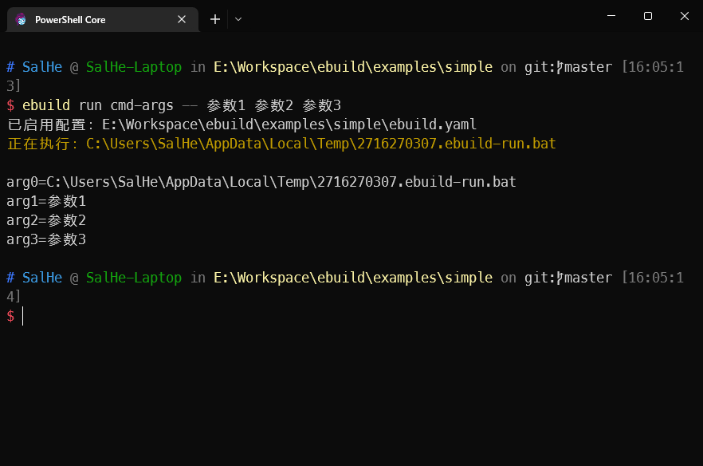

# 工程脚本

也许您在工程需要做除了编译之外的一些重复工作，重复做的话特别烦。一般可以将这些重复工作写成脚本，在需要的时候执行一下脚本即可，就不用手动操作了。`ebuild`刚好集成了一些相关的功能。

## 工程相关脚本

在`ebuild.yaml`中有一个名为`scripts`的节点，其下可以存放若干脚本，可以使用[`ebuild run`](../cli/ebuild_run.md)执行。您大可将工程相关的一些固定操作写成脚本放到`scripts`中。`ebuild`在执行这些脚本的时候，会传递一些环境变量

```yaml
project:
  # ......
scripts:
  show-envs: |
    @echo off
    echo EBuild="%EBUILD_EXECUTABLE_PATH%"
    echo 易语言="%ELANG_DIR%"
    echo Ecl="%ECL_DIR%"
    echo E2Txt="%E2Txt_DIR%"
  get-input: |
    @echo off
    @REM 演示如何获取用户输入
    
    set /p Username=用户名：
    set /p Password=密码：
    
    echo/
    echo 您的用户名：%Username%
    echo 您的密码：%Password%
  cmd-args: |
    @echo off
    echo arg0=%0
    echo arg1=%1
    echo arg2=%2
    echo arg3=%3
```

在上述配置中我们定义了三个脚本：`show-envs`、`get-input`、`cmd-args`。分别演示了输出`ebuild`传递的环境变量、从标准输入获取用户输入、获取传递给脚本的命令行参数。

要执行上述脚本，我们只需要在命令行中执行`ebuild run XXX`。


## 向脚本传递参数

如果您要想所执行的脚本传递参数，只需要执行：

```shell
ebuild run XXX -- 命令行参数...
```

如：




## 使用易语言程序作为脚本

也许您不熟悉`bat`脚本的编写，那么您可以选择使用易语言来编写您的脚本。然后使用`ebuild`来运行(run)您的源文件即可。

比如当前工程有源文件[`<工程根目录>\scripts\易语言做脚本示例.e`](https://github.com/SalHe/ebuild/blob/4f53059ce09148ee58821b8460b8cef8e6bbd18e/examples/simple/scripts/%E6%98%93%E8%AF%AD%E8%A8%80%E5%81%9A%E8%84%9A%E6%9C%AC%E7%A4%BA%E4%BE%8B.e)。其代码如下：

```
.版本 2

.程序集 程序集1

.子程序 _启动子程序, 整数型, , 本子程序在程序启动后最先执行
.局部变量 命令行参数, 文本型, , "0"
.局部变量 i, 整数型


标准输出 (, “你好，这是脚本！” ＋ #换行符)
标准输出 (, “它会被自动编译并执行！” ＋ #换行符)
标准输出 (, #换行符)

标准输出 (, “Ebuild: ” ＋ 读环境变量 (“EBUILD_EXECUTABLE_PATH”) ＋ #换行符)
标准输出 (, “易语言: ” ＋ 读环境变量 (“ELANG_DIR”) ＋ #换行符)
标准输出 (, “Ecl: ” ＋ 读环境变量 (“ECL_DIR”) ＋ #换行符)
标准输出 (, “E2Txt: ” ＋ 读环境变量 (“E2TXT_DIR”) ＋ #换行符)
标准输出 (, #换行符)

标准输出 (, “命令行参数：” ＋ #换行符)
取命令行 (命令行参数)
.计次循环首 (取数组成员数 (命令行参数), i)
    标准输出 (, 命令行参数 [i] ＋ #换行符)
.计次循环尾 ()
标准输出 (, #换行符)

标准输出 (, “工程根路径：” ＋ 读环境变量 (“EBUILD_PROJECT_ROOT_DIR”) ＋ #换行符)
标准输出 (, “工程输出路径：” ＋ 读环境变量 (“EBUILD_PROJECT_OUTPUT_DIR”) ＋ #换行符)
标准输出 (, #换行符)

返回 (0)  ' 可以根据您的需要返回任意数值
```


您可以执行以下命令来"执行"易语言源文件：

```shell
ebuild run ./scripts/易语言做脚本示例.e -- 传递给易语言程序的命令行参数...
```

比如：


::: tip ebuild是如何执行源文件的？

其实`ebuild`只是自动使用`ecl`完成了将您所指定的源码编译成可执行文件的过程，在上面的图中我们也可以看到`ebuild`编译源文件的提示。

因为"执行"过程中需要编译源文件，所以建议您的源文件不应该太大。

:::